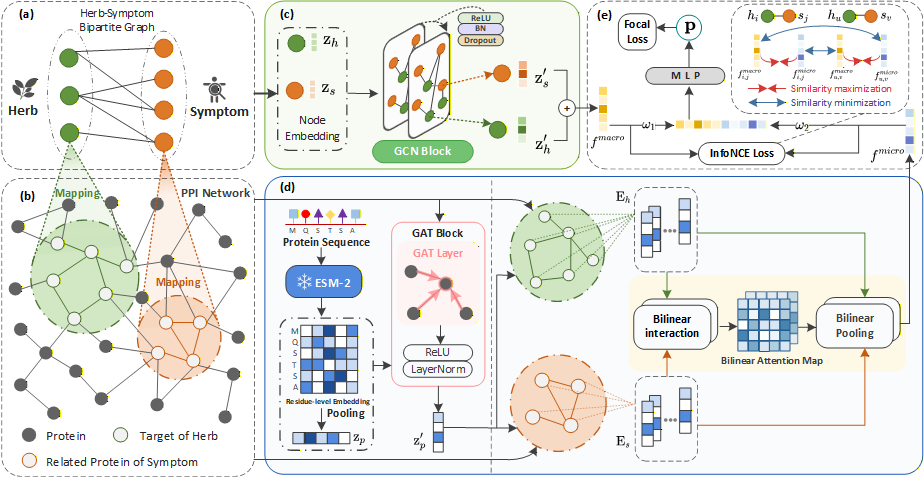

# DualHSA

Code and datasets for:
> DualHSA: A Dual-Level Interpretable Attention Model for Predicting Herb-Symptom Associations and Mechanisms of Action

## Framework



# Example to Run the Codes
* independent test on ./data/data_tvt

```bash
python main.py --config HSA_config.json
```


# Environment Requirements
The code has been tested running under Python 3.8. The required package are as follows:

- python == 3.8.18
- pytorch == 1.12.1 
- numpy == 1.24.3
- scikit-learn == 1.3.2
- torch-geometric == 2.5.3
- pandas == 1.5.3
- networkx == 3.1
- scipy == 1.10.1


# Contact


Please feel free to contact us if you need any help ([nyj_1203@webmail.hzau.edu.cn](mailto:nyj_1203@webmail.hzau.edu.cn) or [zhangwen@mail.hzau.edu.cn](mailto:zhangwen@mail.hzau.edu.cn)).
